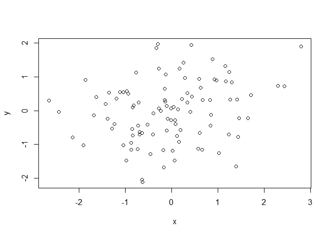

Class4
================
Liv
September 14,2017

chunk1
------

``` r
numbers<-rnorm(1,100)
mean(numbers)
```

    ## [1] 101.2968

``` r
#this is a comment, if i put the # outside the chunk it will be as a header
x<-rnorm(100)
y<-rnorm(100)
plot(x,y)
```


